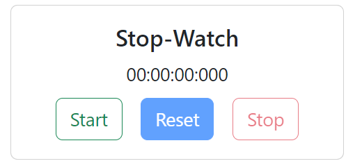

# Stopwatch Timer

## Requirements
- [ ] Start Timer Button
- [ ] Stop Timer Button
- [ ] Rests Timer Button
- [ ] A simple display

## What we have done

1. Created a simple UI with 3 buttons start, stop and reset.
2. Now in Js file there is bit DOM Manipulation
3. Logic:
 - initially we are initialized elapsed time=0
 - when Start Button is pressed we will use Date.now() object of js
 - Now we are storing start time every time we hit start button and are starting interval called timer and there we are updating elapsed time.
 - Stop button we are updating elapsed time as previous elapsed time and clearing the timer interval
 - Reset Button is resetting everything to 0
 - We are also maintaining a check flag for disabling and enabling buttons
 - Logic for calculating time from Date.now() which is giving total ms from epoch is simple maths